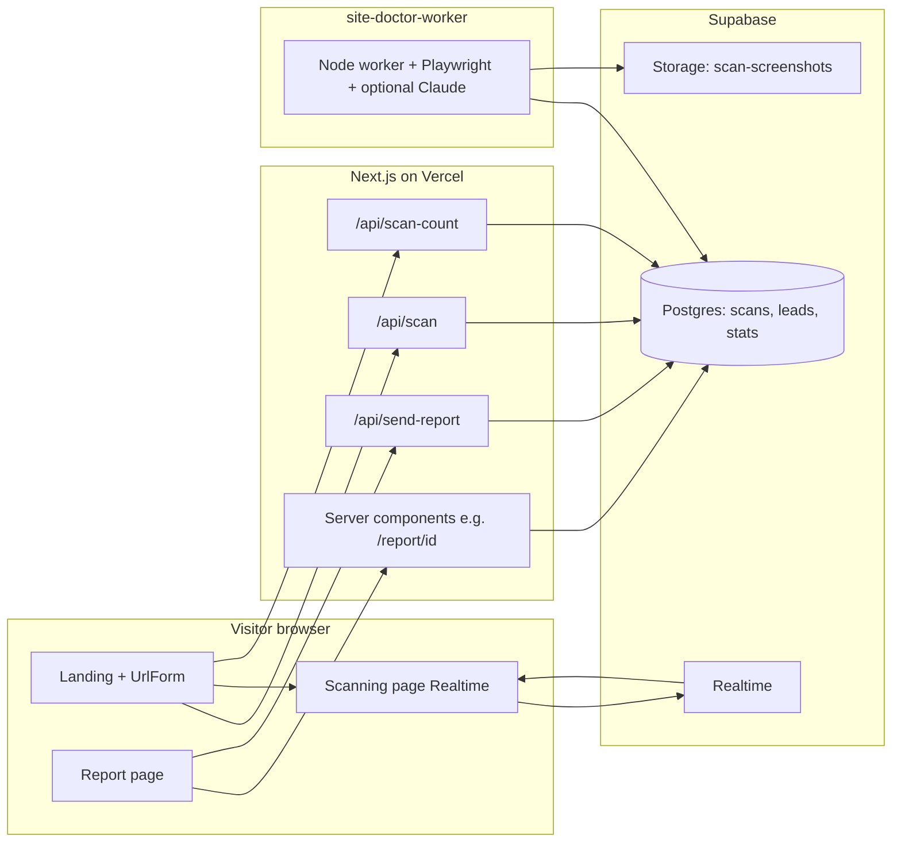

# Site Doctor (webDoctor)

**Site Doctor** is a marketing and product web app for **AI-assisted “client’s eye” website diagnostics**: a visitor enters a public URL, a background worker captures desktop/mobile screenshots and (optionally) runs a **Claude** vision analysis, and the user sees a scored report with issues and recommendations. The customer-facing UI is **Russian**; this README is in English for GitHub and contributors.

**Production site:** [https://www.sitedoctor.live](https://www.sitedoctor.live)

---

## Table of contents

1. [High-level architecture](#high-level-architecture)
2. [Repository layout](#repository-layout)
3. [End-to-end user flow](#end-to-end-user-flow)
4. [Tech stack](#tech-stack)
5. [Environment variables](#environment-variables)
6. [Supabase: data model and expectations](#supabase-data-model-and-expectations)
7. [SQL migrations in this repo](#sql-migrations-in-this-repo)
8. [HTTP APIs (Next.js App Router)](#http-apis-nextjs-app-router)
9. [Rate limiting and abuse controls](#rate-limiting-and-abuse-controls)
10. [Transactional email (Resend)](#transactional-email-resend)
11. [Branding, domains, and contact strings](#branding-domains-and-contact-strings)
12. [Local development](#local-development)
13. [Deployment](#deployment)
14. [Design and product notes](#design-and-product-notes)
15. [Further reading](#further-reading)

---

## High-level architecture



- **Next.js 14 (App Router)** serves the landing, scanning UI, report pages, and serverless API routes.
- **Supabase Postgres** holds scan rows, optional leads, and a global stats counter.
- **Supabase Realtime** pushes `scans` row updates to the scanning page so progress animates without polling-only UX.
- **site-doctor-worker** (separate Node service, often on **Railway**) subscribes to new `pending` scans (and processes backlog on startup), runs **Playwright** against the target URL, uploads screenshots to **Supabase Storage**, and writes **`scan_result` JSON** back to `scans`.
- **Resend** sends optional “email me this report” messages from the Next API (not inbound email ingestion).

---

## Repository layout

| Path | Role |
|------|------|
| `app/` | Next.js routes: landing (`page.tsx`), `scanning/[id]`, `report/[id]`, `report/sample`, `privacy`, API routes under `app/api/*`. |
| `components/` | UI: `landing/*`, `scanning/*`, `report/*`, shared `Logo`, `HeroRobot`, shadcn-style `ui/*`. |
| `lib/` | Shared logic: Supabase clients, URL helpers, report view-model (`scan-report.ts`), stats (`stats.ts`), rate limit helper, email HTML (`emails/report-email.ts`), brand constants (`brand.ts`). |
| `public/` | Static assets (logos, robots, etc.). |
| `supabase/migrations/` | SQL snippets to run in Supabase for `scan_result` and Storage bucket (see below). |
| `site-doctor-worker/` | Long-running worker: Realtime listener, Playwright, Anthropic, Dockerfile for Railway. Has its own **`site-doctor-worker/README.md`**. |
| `scripts/` | e.g. `copy-assets.mjs` for asset maintenance. |
| `landing-spec.md`, `landing-spec-v2-addendum.md` | Product/copy specs (not executed at runtime). |

---

## End-to-end user flow

1. **Landing** (`/`): hero with URL form, marketing sections, FAQ. Hero shows **“Сегодня осмотрено: N сайтов”** where `N` comes from the **`stats`** table (`lib/stats.ts`), with a client-side motion treatment on the stat line (`components/landing/HeroClient.tsx`).
2. User submits a URL → **`POST /api/scan`** creates a row in **`scans`** with `status: "pending"` (and IP / UA for rate limiting).
3. On success, the client calls **`POST /api/scan-count`** (fire-and-forget) to bump the public counter via RPC, then navigates to **`/scanning/[scanId]`**.
4. **Scanning page** subscribes to Realtime updates on that `scans` row; when status becomes **`ready`**, it redirects to **`/report/[scanId]`**.
5. **Report page** (server component) loads the scan; if `status !== "ready"` it shows pending/failed states; if ready, it builds a view model and renders **`ScanReportView`** with score, diagnosis list, screenshots, sample fix block, CTA, and **`ReportSaveBlock`** (copy link + optional email).
6. **Sample report** (`/report/sample`) uses static sample data (`lib/sample-report.ts`); email save is disabled there.

---

## Tech stack

- **Next.js** `14.2.x`, **React** `18`, **TypeScript**
- **Tailwind CSS** + **framer-motion** (landing motion, hero stat line)
- **Supabase** (`@supabase/supabase-js`): anon key in browser, service role on server routes and worker
- **Resend** (`resend` package) for outbound report emails
- **Radix** primitives (accordion, slot) + **lucide-react**
- Worker: **Playwright**, optional **Anthropic** Claude (vision), **Docker** on Railway

---

## Environment variables

### Next.js app (Vercel / `.env.local`)

| Variable | Required | Purpose |
|----------|----------|---------|
| `NEXT_PUBLIC_SUPABASE_URL` | Yes | Supabase project URL. |
| `NEXT_PUBLIC_SUPABASE_ANON_KEY` | Yes | Public anon key (browser + `getScanCount` server read). |
| `SUPABASE_SERVICE_ROLE_KEY` | Yes for APIs / report SSR | Service role JWT for `supabaseAdmin` — **never expose to client**. |
| `RESEND_API_KEY` | For email CTA | Without it, `POST /api/send-report` returns **503** (“Email не настроен на сервере”). |
| `MAX_SCANS_PER_IP_PER_HOUR` | No (default **2**) | Cap new scans per IP per rolling window. |
| `SCAN_RATE_LIMIT_WINDOW_HOURS` | No (default **1**) | Window length in hours for scan rate limit. |
| `SCAN_RATE_LIMIT_DISABLED` | No | Set to `true` to disable scan rate limit (also disabled if max is `0`). |

### Worker (`site-doctor-worker`)

See **`site-doctor-worker/README.md`**. Uses `SUPABASE_URL` + `SUPABASE_SERVICE_ROLE_KEY` (and optional `ANTHROPIC_*`, `SCAN_SCREENSHOTS_BUCKET`).

---

## Supabase: data model and expectations

The app and worker assume **Postgres** tables and functions that are **not all** defined by SQL files in this repo (only partial migrations exist). Below is what the **code paths** expect so you can align your Supabase project.

### Table: `public.scans`

Used by: `POST /api/scan`, worker, scanning UI, report page.

Typical columns referenced in code:

- `id` (uuid text in URLs)
- `url`, `normalized_url`
- `status` — one of: `pending`, `scanning`, `analyzing`, `ready`, `failed` (see `lib/scan-display.ts`)
- `progress` (number), `current_step` (string, Russian step labels aligned with worker)
- `ip_address`, `user_agent` (set on insert from Next API)
- `error_message`, `completed_at`, `started_at` (worker / recovery)
- `desktop_screenshot_url`, `mobile_screenshot_url`
- **`scan_result`** (`jsonb`) — versioned payload; worker writes **v2** with optional `ai_analysis`, `ai_failed`, etc.

### Table: `public.leads`

Used by: `POST /api/send-report`.

Insert fields include: `scan_id`, `email`, `source` (`"report_email"`), `scan_url`, `ip_address`, `user_agent`.

Updates after send attempt: `email_sent`, `email_sent_at`, `resend_id`, `email_error`.

### Table: `public.stats`

Used by: `lib/stats.ts` (hero count).

Expects a row with **`id = 1`** and numeric **`scan_count`**. If missing/unreadable, the UI falls back to a small default constant in code.

### RPC: `increment_scan_count`

Called by: `POST /api/scan-count` (`app/api/scan-count/route.ts`).

Must exist in Supabase and return the new count (implementation is project-specific — create in SQL to match your counter rules).

### Realtime

The scanning client subscribes to changes on **`scans`** for the active `id`. Enable **Realtime** for that table in Supabase if updates are not pushed.

### Storage

Bucket **`scan-screenshots`** (configurable in worker) for PNGs; see migration file below.

---

## SQL migrations in this repo

Run these in **Supabase → SQL → New query** (order matters logically: column before worker writes JSON; storage when screenshots enabled):

| File | Purpose |
|------|---------|
| `supabase/migrations/20260109180000_add_scan_result_to_scans.sql` | Adds **`scan_result`** `jsonb` to **`scans`**. |
| `supabase/migrations/20260110120000_scan_screenshots_storage.sql` | Creates **`scan-screenshots`** bucket and policies. |

---

## HTTP APIs (Next.js App Router)

| Method & path | Role |
|---------------|------|
| **`POST /api/scan`** | Validates URL, optional per-IP scan rate limit, inserts `scans` row (`pending`), returns `{ scanId }`. Blocks localhost/private IPs. |
| **`POST /api/scan-count`** | In-memory cooldown per IP (`lib/rate-limit.ts`, 30s), then calls **`increment_scan_count`** RPC. Client triggers after successful scan create. |
| **`POST /api/send-report`** | Validates email + `scanId`, per-IP cap on **`leads`** rows in last hour (default **3**), inserts **lead**, sends HTML email via **Resend**, updates lead with send result. |

---

## Rate limiting and abuse controls

1. **New scans** (`/api/scan`): rolling window per IP against **`scans`** table (`MAX_SCANS_PER_IP_PER_HOUR`, `SCAN_RATE_LIMIT_WINDOW_HOURS`). **429** with Russian message when exceeded.
2. **Scan count bumps** (`/api/scan-count`): best-effort **30s** per-IP in-process map (mitigates spam clicks; not a distributed limiter).
3. **Report emails** (`/api/send-report`): max **3** lead rows per IP per rolling **1 hour** (constant `MAX_EMAILS_PER_HOUR` in route file).

---

## Transactional email (Resend)

- **Outbound only**: the API sends **to the address the user typed**; there is **no** inbound mailbox or “emails received in Supabase.”
- **From / reply-to:** `doctor@sitedoctor.live` (see `app/api/send-report/route.ts`).
- **Link in email** is built to `https://www.sitedoctor.live/report/{scanId}`.
- HTML template: `lib/emails/report-email.ts` (uses brand/telegram helpers where applicable).

---

## Branding, domains, and contact strings

- **Production site / report links** use **`sitedoctor.live`** (e.g. canonical report URL in email API).
- **`lib/brand.ts`** still carries **`sitedoctor.ai`** and **`hi@sitedoctor.ai`** for general brand/contact copy (e.g. privacy `mailto:`). This is intentional split unless you consolidate: **`.live`** = live app + Resend domain; **`.ai`** = legacy/marketing contact.
- Telegram handle is centralized (e.g. `lib/telegram.ts`, `BRAND.contactTelegram`).

---

## Local development

### Next app (repo root)

```bash
npm install
# Create .env.local with NEXT_PUBLIC_SUPABASE_URL, NEXT_PUBLIC_SUPABASE_ANON_KEY,
# SUPABASE_SERVICE_ROLE_KEY, and optionally RESEND_API_KEY (see table above).
npm run dev
```

Open [http://localhost:3000](http://localhost:3000).

You need working **Supabase** env vars and a running **worker** (or manual DB updates) for a full scan to reach **`ready`**.

### Worker

From **`site-doctor-worker/`**:

```bash
npm install
npx playwright install chromium
npm run dev
```

Details: **`site-doctor-worker/README.md`**.

### Scripts

- `npm run lint` — ESLint
- `npm run build` — production build
- `npm run copy-assets` — asset copy script when needed

---

## Deployment

- **Next.js:** typically **Vercel** (project root). Set all `NEXT_PUBLIC_*` and server secrets there.
- **Worker:** typically **Railway** with **Docker** root `site-doctor-worker` (see worker README). Requires Playwright/Chromium in the image.

Ensure **CORS / auth** are not blocking the anon client from reading `scans` for the scanning page (RLS policies must allow read for the rows users need, or use a pattern your security model allows).

---

## Design and product notes

- Landing is optimized for **Russian** SMB positioning (diagnosis in ~60 seconds, “client lens” not pure SEO audit).
- **`ReportSaveBlock`**: copy report URL; optional email requires **`RESEND_API_KEY`**.
- **Motion**: hero stat line uses **mount-based** `framer-motion` with **`useReducedMotion`** respect (`HeroClient.tsx`).
- Internal specs: `landing-spec.md`, `landing-spec-v2-addendum.md`.

---

## Further reading

- **[`site-doctor-worker/README.md`](./site-doctor-worker/README.md)** — worker env, Docker/Railway, AI optional path, recovery of stuck `analyzing` scans.
- **Supabase migrations** — under [`supabase/migrations/`](./supabase/migrations/).

---

## License / ownership

Private project (`"private": true` in `package.json`). All rights reserved unless otherwise stated by the repository owner.
